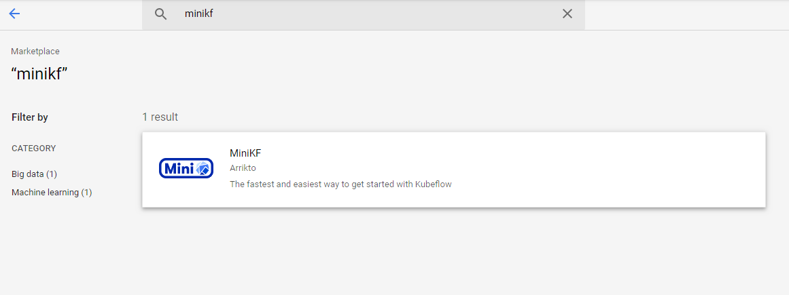
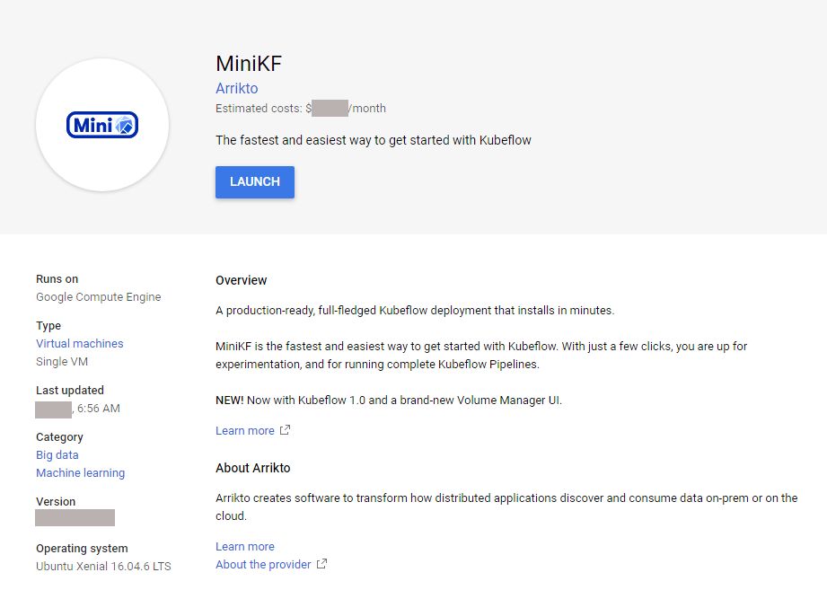

# Set Up MiniKF on Google Cloud

## Two Options

You have two options for setting up MiniKF:

1. Follow the setup video
2. Follow the step-by-step instructions.

## Follow the Set Up Video

<iframe width="1704" height="500" src="https://www.youtube.com/embed/porxGAcWnq8" title="YouTube video player" frameborder="0" allow="accelerometer; autoplay; clipboard-write; encrypted-media; gyroscope; picture-in-picture" allowfullscreen></iframe>

## Follow the Step-by-Step Instructions

#### 1. Find MiniKF in the Google Cloud Marketplace.

Open [Google Cloud Marketplace](https://console.cloud.google.com/marketplace) and search for "MiniKF".

#### 2. Select the MiniKF virtual machine by Arrikto.

#### 3. Click the *LAUNCH* button and select your project.

#### 4. Choose a name and zone for your *MiniKF* instance.

In the Configure & Deploy window, choose a name and a zone for your MiniKF instance and leave the default options. Then click on the Deploy button.

#### 5. Wait for the MiniKF compute instance to boot up.

#### 6. SSH to MiniKF

When the MiniKF VM is up, connect and log in by clicking on the SSH button. Follow the on-screen instructions to run the command minikf to see the progress of the deployment of Minikube, Kubeflow, and Rok. This will take a few minutes to complete.

#### 7. Log in to MiniKF

When installation is complete and all pods are ready, visit the MiniKF dashboard and log in using the MiniKF username and password:

Congratulations! You have successfully deployed MiniKF on GCP. You can now create notebooks, write your ML code, run Kubeflow Pipelines, and use Rok for data versioning and reproducibility.