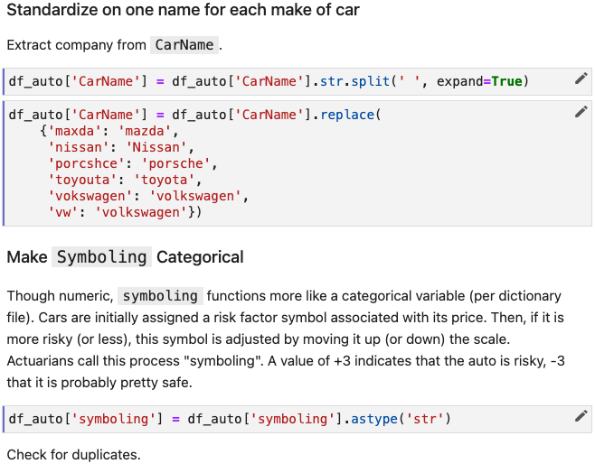

# Solution - Lab: Skip Cells

## Requirements
1. Update the cells in the *Clean Data* section of our notebook so that cells
not necessary for cleaning data will be excluded from the `clean_data` pipeline
step. Here’s what `clean_data` looks like as you begin this exercise. 

{: style="display: block; margin: auto; width:80%"}

## Solution

We definitely need the first cell in the *Clean Data* section so no changes
are required here.

{: style="display: block; margin: auto; width:80%"}

This step, however, displays the data types for fields in this data set. We
use the output to identify the fact that we need to change the data type for
the ‘symboling’ column to ‘str’. However, we do not need to execute the cell
on each run of the pipeline we’re building.

{: style="display: block; margin: auto; width:80%"}

The first two cells in the block below work together to fix some misspellings
and ensure that we are using the same label for ‘CarName’ across all rows.

{: style="display: block; margin: auto; width:80%"}

The cell below is diagnostic. It turns out that we don’t have any duplicates
in this data set, but even if we did, we do not need to run this cell as part
of the `clean_data` step or any pipeline step. We would only run cells that
dealt with duplicates. 

{: style="display: block; margin: auto; width:80%"}

This cell is just a means of getting a quick peek at the data. It doesn’t do
any data cleaning.

{: style="display: block; margin: auto; width:80%"}

!!! important "Follow Along
    Before continuing, please ensure the `clean_data` step in your notebook
    matches the solution above.