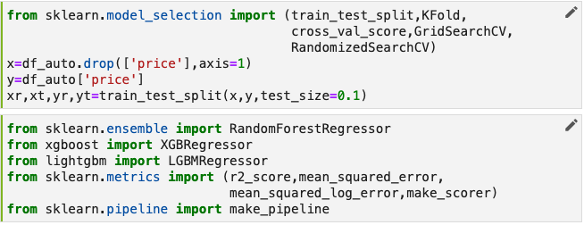
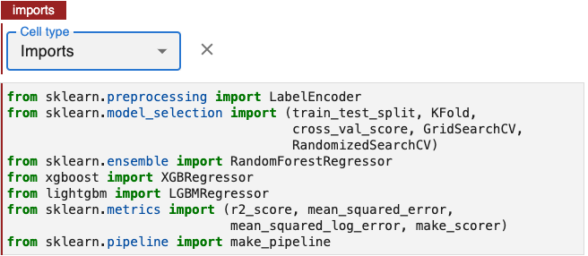

# Solution - Lab: Imports

## Requirements

Review all cells in the Modeling section of our notebook and make the following
changes:

1. Create a cell just below the “Modeling” header.
2. Move all the import statements below this point in the notebook into the new
cell you’ve just created.
3. Annotate the new cell you created as an Imports cell.

## Solution

In the *Modeling* section of our notebook, there are import statements in the
*Prep Data* and *Build Models* subsections.

In the *Prep Data* subsection, we have this cell.

{: style="display: block; margin: auto; width:80%"}

In the *Build Models* subsection, we have these cells.

{: style="display: block; margin: auto; width:80%"}

**To satisfy requirements 1 and 2**, relocate the import statements from these
three cells to a new cell just below the “Modeling” header. When you’re done:

- The new cell should look like the cell depicted below.
- The three cells depicted above should not contain any import statements.
- The third cell above should be removed since it will be empty after 
  relocating the import statements it contains.

{: style="display: block; margin: auto; width:80%"}

**To satisfy requirement 3**, apply the *Imports* annotation to our new cell.

{: style="display: block; margin: auto; width:80%"}

