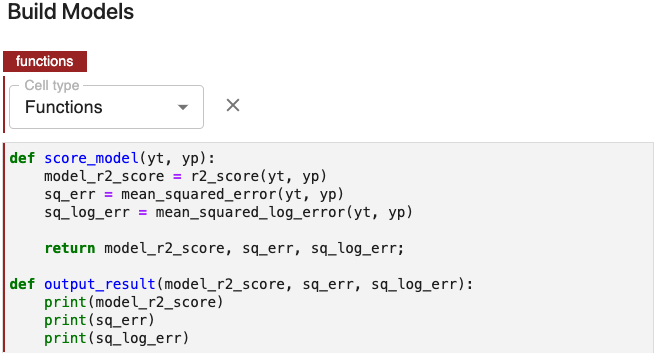

# *Functions* Cells

One annotation we’ve not yet discussed is the *Functions* cell type. Kale
provides this cell type to enable you to identify blocks of code containing:

- Functions used later in your machine learning pipeline.
- Global variable definitions (other than pipeline parameters) and code that
  initializes lists, dictionaries, objects, and other values used throughout
  your pipeline.

*Functions* cells help Kale identify all dependencies for pipeline steps. As
you know, Kale prepends the code in every cell annotated with *Imports* to the
code in the cells you’ve annotated with *Pipeline Step*. In addition, Kale also
prepends the code in every *Functions* cell as part of this process.

Kale executes each pipeline step as if it were a notebook composed of all
*Imports* cells in your notebook followed by all *Functions* cells, and then
followed by the cells annotated with *Pipeline Step* for the specific step in
question. Therefore all imports, variable declarations and setup statements
included in each *Imports* cell and all functions and other declarations found
in all *Functions* cells will execute before the core code for the pipeline
step.

Organizing functions together and annotating those cells with the *Functions*
label ensures that Kale can organize the code for each step and set up its
execution environment correctly.

!!! important "Follow Along"
    Please follow along and make the corresponding changes in your own copy of our notebook.

Let’s get some experience with Functions cells by abstracting out the scoring and output
functionality from our evaluation steps. The last several lines for each of our evaluation
steps are nearly identical. 

{: style="display: block; margin: auto; width:80%"}

{: style="display: block; margin: auto; width:80%"}

{: style="display: block; margin: auto; width:80%"}

Let’s write two functions to handle this logic and place them in a cell we’ll annotate
using the *Functions* label.

We’ll place this cell at the very top of the *Build Models* subsection

{: style="display: block; margin: auto; width:80%"}

Then let's modify each of our evaluation steps accordingly.

{: style="display: block; margin: auto; width:80%"}

{: style="display: block; margin: auto; width:80%"}

{: style="display: block; margin: auto; width:80%"}

This simple example illustrates the purpose of *Functions* cells and how to create and
annotate them. In later modules, we’ll make greater use of *Functions* cells.
