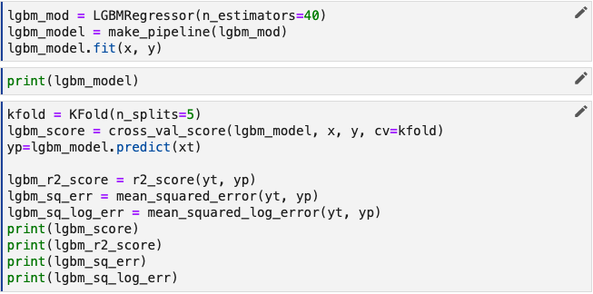

# Design for Iteration

To complete our pipeline we need to do a little code reorganization. We’ll be
training and evaluating three models simultaneously. It doesn’t make sense to
combine the model training and evaluation code in a single cell or step as we
have it in the example depicted below. 

{: style="display: block; margin: auto; width:80%"}

We can use the resources of a Kubernetes cluster more efficiently if we split
these phases into separate pipeline steps.

In addition, Kale provides a snapshotting feature that enables you to return to
the execution state of any step during a pipeline run. So, if you want to make
changes to an evaluation step, you can do so and then rerun the pipeline from
just after the training step completes. For long-running pipelines this can
save a lot of time. 

!!! important
    Break your pipeline down to separate all discrete steps you might want to
    iterate on independently from other components of your workflow. 

As an example of designing pipelines for iteration, we’ll demonstrate
reorganizing the code for the LGBM regression model into separate cells and
steps. 

{: style="display: block; margin: auto; width:80%"}

!!! important "Follow Along"
    Please follow along and make the corresponding changes in your own copy of
    our notebook.

The code for the LGBM model is depicted in the figure above. As a first step,
let’s split this cell into multiple cells for model training, diagnostic output,
and evaluation. We’ll leave the print statements together with the evaluation
code, because we want to output the result as part of the last step for these
branches of our pipeline.

{: style="display: block; margin: auto; width:80%"}

Next, we’ll annotate these cells to create two new pipeline steps, `train_lgbm`
and `eval_lgbm`. 

`split_data` is the step on which `train_lgbm` depends and `train_lgbm` is the
step on which `eval_lgbm` depends.

{: style="display: block; margin: auto; width:80%"}

Our pipeline can now be depicted as:

{: style="display: block; margin: auto; width:80%"}