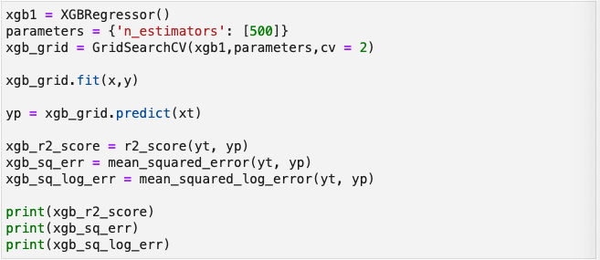
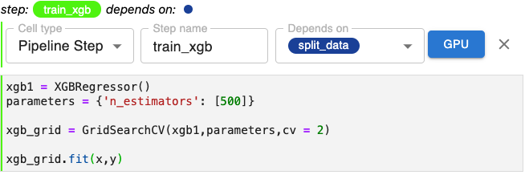
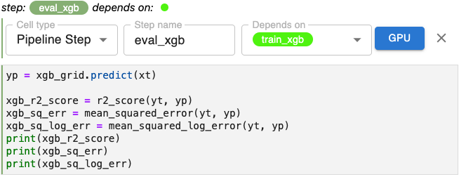

# Solution - Lab: XGB train and eval steps

Following a process similar to what we did for the LGBM and RF regression
models above, reorganize the code and apply the appropriate annotations for
the XGB model. For this lab, the code you will work with is found in this cell.

{: style="display: block; margin: auto; width:80%"}

## Requirements 

Reorganize and annotate the code for the XGB model to meet the following
requirements:

1. Create a new pipeline step called `train_xgb` to train the XGB model.
2. Create a new pipeline step called `eval_xgb` to evaluate the XGB model.
3. Specify the correct dependency relationships for both steps. **Note that
   the `train_xgb` step begins a branch in our pipeline. This branch can run
   in parallel with the branches for the LGBM and RF models.**
4. For each step, include only cells that contain code that is core to the
   step.
5. Exclude cells that are not core to one step or the other using the
   *Skip Cell* annotation.

## Solution

**Requirements 1, 4**: Following the example for the XGB model, we need to
isolate the code that creates and trains the XGB model in a single cell.
Requirements 1 and 4 are addressed in the code depicted in this figure.

{: style="display: block; margin: auto; width:80%"}

**Requirement 3**: Like, `train_lgbm` and `train_xgb`, this step has
`split_data` as a dependency. 

**Requirement 5**: There are no cells to skip for this lab.

**Requirements 2, 4**: The code for the `eval_xgb` step is depicted in the
figure below. We’ll leave the print statements together with the evaluation
code, because we do want to output the result as part of the last step for this
branch of our pipeline.

{: style="display: block; margin: auto; width:80%"}

**Requirement 3**: This step depends on `train_xgb` (uses the value of
`xgb_grid`) and indirectly on `split_data` because it uses the data values
referenced by the variables: `xt` and `yt`.

