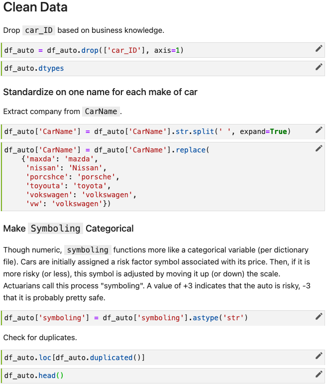
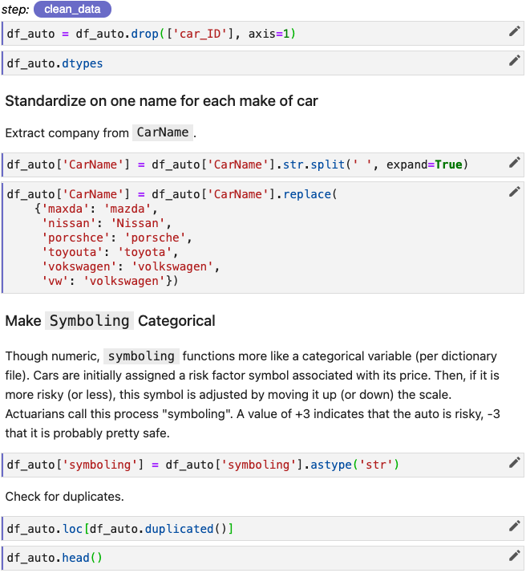

# Multi-Cell Pipeline Steps

<iframe width="675" height="380" src="https://www.youtube.com/embed/UErstORv8Nc?rel=0&more=0" title="YouTube video player" frameborder="0" allow="accelerometer; autoplay; clipboard-write; encrypted-media; gyroscope; picture-in-picture" allowfullscreen></iframe>

## Text Version of this Lesson

The *Clean Data* section of our notebook performs three different tasks to
clean up our dataset. There are several cells here that, together, do the work
of a data cleaning step. 

{: style="display: block; margin: auto; width:80%"}

As we hinted in the previous section, Kale enables you to include multiple
cells in a single annotation for a pipeline step.

!!! important "Follow Along"
    Please follow along in your own copy of our notebook as we complete the steps
    below.

Let’s define the second step of our pipeline. As we did before, we need to annotate
a cell with the *Pipeline Step* label. In situations like this where the step is
composed of multiple cells, you’ll want to ensure that all cells are annotated
accordingly.

Annotate the first cell of the data cleaning step and name this step `clean_data`.
The remaining cells for this step will be included in this annotation. If you can’t
remember exactly how to annotate a cell, see the example for `read_data` above or
review the Kale documentation.

When you have finished annotating `clean_data`, that portion of your notebook should
look like the following.

{: style="display: block; margin: auto; width:80%"}